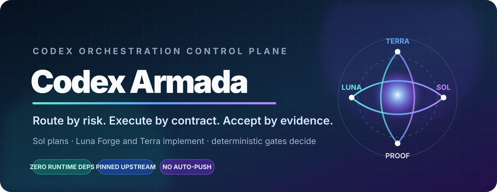
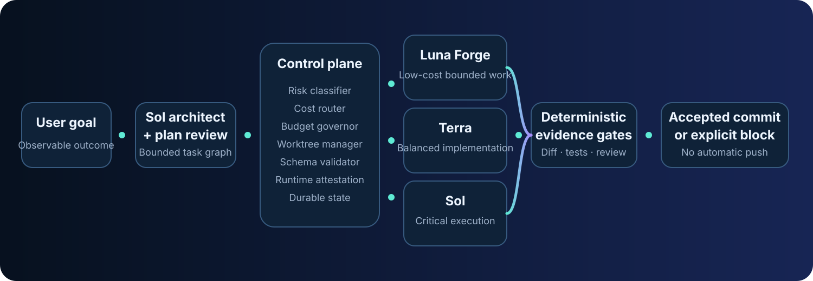

<p align="center">
  
</p>

<p align="center">
  <a href="CHANGELOG.md"></a>
  <a href="https://github.com/RealAhmedOsama/Codex-Armada/actions/workflows/validate.yml"></a>
  <a href="https://www.python.org/"></a>
  <a href="https://github.com/RealAhmedOsama/Luna-Forge"></a>
  <a href="LICENSE"></a>
</p>

<p align="center">
  
  
  
  
  
  
</p>

<h1 align="center">Codex Armada</h1>

<p align="center">
  <strong>Route by risk. Execute by contract. Accept by evidence.</strong><br>
  A public, zero-dependency Python control plane that coordinates GPT-5.6 Sol, Terra, and Luna in Codex CLI while keeping Git boundaries, verification, cost accounting, and final acceptance deterministic.
</p>

<p align="center">
  <a href="#why-codex-armada"><strong>Why</strong></a> ·
  <a href="#results-at-a-glance"><strong>Results</strong></a> ·
  <a href="#how-it-works"><strong>Architecture</strong></a> ·
  <a href="#quick-start"><strong>Quick start</strong></a> ·
  <a href="#routing-profiles"><strong>Profiles</strong></a> ·
  <a href="#luna-forge-integration"><strong>Luna Forge</strong></a> ·
  <a href="#safety-model"><strong>Safety</strong></a> ·
  <a href="#documentation"><strong>Docs</strong></a>
</p>

> [!IMPORTANT]
> Codex Armada optimizes **verified engineering throughput per unit of cost**. It does not claim that a cheaper model is universally equivalent to a frontier model, and it does not treat model output as proof. Every accepted implementation must survive local schema validation, Git scope checks, deterministic verification, runtime-routing checks when required, and risk-based review.

---

## Why Codex Armada

Codex gives developers powerful models with different capability and cost profiles. The hard part is not selecting one model manually. The hard part is building a repeatable workflow that answers five questions correctly:

1. **What is the smallest bounded task that can be verified?**
2. **Which model is strong enough for that task without wasting credits?**
3. **What files and actions is the worker allowed to own?**
4. **What evidence proves the change is correct?**
5. **Who is allowed to accept, commit, or escalate the result?**

Codex Armada turns those questions into an executable control plane:

- **Sol** plans, resolves consequential ambiguity, and reviews high-risk work.
- **Terra** handles general implementation where capability and cost need balance.
- **Luna + [Luna Forge](https://github.com/RealAhmedOsama/Luna-Forge)** handles clear, bounded, high-volume work under an evidence-focused task capsule.
- **Python**, not the worker, owns state transitions, budget gates, exact source pinning, structured-output validation, worktrees, scope enforcement, verification, and acceptance.

The result is a workflow that can save credits on eligible tasks without turning reliability into a prompt-level promise.

---

## Results at a glance

<!-- metrics:start -->
| Measured or derived result | Value | Evidence |
|---|---:|---|
| Python source modules | **33** | Generated from `src/codex_armada` |
| Physical Python source lines | **5,869** | Generated by `scripts/generate_metrics.py` |
| Automated test cases | **72** | AST count from `tests/test_*.py` |
| CLI commands | **14** | `codex-armada --help` |
| Routing profiles | **4** | `economy`, `balanced`, `quality`, `critical` |
| Runtime dependencies | **0** | `pyproject.toml` |
| Supported Python versions | **3.11–3.13** | Package metadata and CI matrix |
| Supported host families | **Linux, macOS, Windows** | CI matrix and platform-neutral runtime |
| Luna vs Sol equal-token Codex credit reduction | **80%** | Derived from the configured official token rates |
| Terra vs Sol equal-token Codex credit reduction | **50%** | Derived from the configured official token rates |
| Pinned Luna Forge release | **2.2.1** | Commit `ff37273ba761…` |
<!-- metrics:end -->

The equal-token percentages compare only the published token rates. They are **not** a promise of end-to-end savings: orchestration, retries, reasoning effort, context size, and review calls affect real usage. Codex Armada records observed token usage when the CLI exposes it and labels fallback estimates explicitly.

Current rate sources:

- [OpenAI Codex rate card](https://help.openai.com/en/articles/20001106-codex-rate-card)
- [OpenAI GPT-5.6 model guidance](https://developers.openai.com/api/docs/guides/latest-model)

---

## How it works

<p align="center">
  
</p>

```text
User goal
  → Sol planning and optional commitment review
  → validated task graph
  → risk and cost routing
  → explicit approval gate when required
  → isolated Git worktree
  → Luna Forge, Terra, or Sol worker
  → local JSON Schema validation
  → runtime model / effort / sandbox attestation
  → changed-file ownership and protected-path checks
  → deterministic verification commands
  → optional fresh Sol final review
  → one focused local task commit
  → safe cherry-pick onto the original branch
  → durable JSON + standalone HTML evidence report
```

### The control plane owns acceptance

A worker may propose a patch and report that tests passed. Codex Armada independently checks the actual repository state. It will not accept a task merely because the model says `complete`.

Acceptance requires the applicable gates to pass:

- final structured output matches the bundled JSON Schema;
- observed model and reasoning effort match the requested route when attestation is required;
- all changed and renamed paths stay inside the task ownership boundary;
- protected files, secrets, project policy, Codex agent files, and Luna Forge installation files remain untouched;
- deletions and production changes were both declared in the plan and explicitly approved;
- changed paths contain no symbolic links;
- deterministic verification exits successfully and does not mutate repository state;
- required final review returns an exact `ship` verdict;
- task commit and final repository HEAD match durable run state.

---

## Quick start

### Requirements

- Python **3.11 or newer**
- Git
- A current Codex CLI installation authenticated to an account with access to the selected models
- Network access on the first Luna route so Codex Armada can fetch the pinned Luna Forge commit

### Install from a clone

```bash
git clone https://github.com/RealAhmedOsama/Codex-Armada.git
cd Codex-Armada
python -m pip install .
```

Using `pipx` keeps the command isolated:

```bash
pipx install .
```

The source checkout also runs without installation:

```bash
./codex-armada.sh --help
```

On Windows:

```powershell
.\codex-armada.bat --help
```

### Initialize a target repository

```bash
codex-armada --repo /path/to/project init
```

By default, Codex Armada creates `.codex-armada.toml` and adds it to the target repository's local `.git/info/exclude`. The policy remains local and does not make the working tree dirty. Use `init --tracked` only when the team deliberately wants to version the policy.

### Validate the environment

```bash
codex-armada --repo /path/to/project doctor
```

Spend a small amount of Codex usage to probe every unique active route:

```bash
codex-armada --repo /path/to/project doctor --probe-models
```

Run a disposable, end-to-end Luna routing canary:

```bash
codex-armada --repo /path/to/project canary --model luna --effort high
```

### Run a goal

```bash
codex-armada --repo /path/to/project run \
  "Add focused regression tests for the pagination parser and verify the affected test project"
```

For a critical task, Codex Armada may stop before execution:

```text
Approval required. Resume with:
codex-armada --repo /path/to/project resume <run-id> --approve <task-id>
```

Nothing is pushed. You review the accepted local commits and push them yourself.

---

## Routing profiles

| Profile | Low risk | Medium risk | High risk | Critical risk | Final review begins at |
|---|---|---|---|---|---|
| `economy` | Luna Forge / High | Luna Forge / High | Terra / High | Sol / xHigh | Critical |
| `balanced` | Luna Forge / High | Terra / High | Terra / xHigh | Sol / xHigh | High |
| `quality` | Terra / Medium | Terra / High | Sol / High | Sol / Max | Medium |
| `critical` | Sol / High | Sol / High | Sol / xHigh | Sol / Max | Low |

`balanced` is the default. It reserves Luna for bounded low-risk work, uses Terra for normal implementation, and raises consequential work to Sol.

Routing is policy, not magic. A task's effective risk can increase because of:

- migrations or database state;
- billing, payments, wallets, or ledgers;
- authentication, authorization, identity, tenancy, or security;
- CI/CD and container build configuration;
- requested deletions or production changes;
- project-defined path rules.

Run `codex-armada benchmark` to inspect the active profile without making model calls.

---

## Luna Forge integration

Codex Armada does **not** vendor or copy Luna Forge into this repository. It consumes the public upstream project directly:

```text
Repository: https://github.com/RealAhmedOsama/Luna-Forge.git
Version:    2.2.1
Commit:     ff37273ba761195ef5ab338d2e90ef3408ce8d8c
```

For each environment, Codex Armada:

1. fetches the exact configured Git ref into a user cache;
2. refuses a commit that differs from `expected_commit`;
3. checks `VERSION`;
4. validates every entry in upstream `MANIFEST.sha256`;
5. rejects unmanifested files and symbolic links;
6. runs upstream `scripts/validate.py` and records a cache validation marker tied to the commit, manifest, version, and validator hash;
7. invokes upstream `scripts/install.py --scope project`;
8. verifies the exact installed Skill tree and `luna-worker.toml`;
9. adds the project-local files to `.git/info/exclude`;
10. records repository, ref, commit, version, and installation digest in task evidence;
11. re-checks the installed files after every Luna worker or reviewer call.

Project-local installation paths:

```text
.agents/skills/luna-forge/
.codex/agents/luna-worker.toml
.luna-forge-backups/
```

A different existing installation is never overwritten silently. Use `forge install --force` only after review; the upstream installer creates a backup first.

Useful commands:

```bash
codex-armada --repo /path/to/project forge status
codex-armada --repo /path/to/project forge fetch
codex-armada --repo /path/to/project forge install --dry-run
codex-armada --repo /path/to/project forge install
codex-armada --repo /path/to/project forge verify
```

See [Luna Forge integration](docs/LUNA_FORGE_INTEGRATION.md) for the full trust and update model.

---

## Task capsules

Workers receive a complete task capsule rather than an open-ended request. A capsule includes:

- one observable objective;
- task kind and risk level;
- exact owned and excluded paths;
- interfaces and compatibility constraints;
- non-goals and approval boundaries;
- verification commands and success conditions;
- base commit and durable run/task identity;
- selected model, effort, sandbox, protocol, and source provenance;
- explicit prohibition of nested agents, automatic push, PR, merge, or deployment.

A plan can be produced by Sol or supplied by the user as JSON:

```bash
codex-armada --repo /path/to/project run \
  "Use the reviewed plan" \
  --plan-file ./plan.json
```

The supplied plan must match the bundled schema. All routing, approval, Git, verification, review, and budget gates still apply.

---

## Safety model

### Git boundaries

- The target working tree must be clean by default.
- Every committed task runs in an isolated Git worktree.
- Each task owns explicit path patterns.
- Renames count both the source and destination paths.
- Failed worktrees are retained for inspection and never cherry-picked.
- Accepted tasks create focused local commits.
- Codex Armada contains no automatic `git push`, PR creation, merge, or deployment path.

### Protected actions

The default policy protects:

```text
.git/**
.codex-armada/**
.codex/**
.agents/**
.luna-forge-backups/**
.codex-armada.toml
AGENTS.md and nested AGENTS.md files
.env files, private keys, certificates, credentials, and secret-like paths
```

Deleting files or changing production/deployment paths requires both:

1. an explicit plan flag; and
2. explicit user approval at resume time.

### Verification command boundary

Verification commands are tokenized and executed without a shell. Shell chaining, redirection, pipes, and separators are rejected. Python verification must use an allowlisted `python -m ...` module. Git commands are limited to read-only verification subcommands.

> [!WARNING]
> Compilers, package managers, test runners, and repository scripts execute code from the target repository with the current user's operating-system permissions. Use trusted repositories or an appropriate OS/container sandbox. Codex Armada constrains orchestration and repository acceptance; it is not a replacement for host isolation.

Read [Security](SECURITY.md) and the [threat model](docs/THREAT_MODEL.md).

---

## Durable state and recovery

State is stored outside the target repository:

| Platform | Default state root |
|---|---|
| Linux | `$XDG_DATA_HOME/codex-armada` or `~/.local/share/codex-armada` |
| macOS | `~/Library/Application Support/CodexArmada` |
| Windows | `%LOCALAPPDATA%\CodexArmada` |

Override it with `CODEX_ARMADA_HOME`. Override the Luna Forge source cache with `CODEX_ARMADA_CACHE_DIR`.

Every run records:

- normalized plan and task graph;
- configuration and capability digests;
- route decisions and model-source provenance;
- prompt hashes by default, or full prompts only when explicitly enabled;
- Codex JSONL event streams and last structured messages;
- token usage, reasoning-output detail, credits, and whether the value was observed or estimated;
- worktree, diff, scope, deletion, and symbolic-link evidence;
- verification command outputs;
- review decisions;
- source and applied commit SHAs;
- standalone JSON and HTML reports.

Resume a durable run:

```bash
codex-armada --repo /path/to/project resume <run-id>
```

A run fails closed if repository HEAD, configuration digest, or capability digest changed after planning.

---

## Command reference

```text
init          Create project-local policy and optionally install Luna Forge
 doctor       Validate Python, Git, Codex, active models, and Luna Forge
 forge        Inspect, fetch, install, or verify the pinned upstream integration
 plan         Create and validate a durable execution plan
 run          Plan and execute a new goal, or continue an existing run
 resume       Resume a durable run and provide required approvals
 status       Inspect one run or list all runs
 report       Generate portable JSON and standalone HTML evidence reports
 verify       Re-check final Git, commit, route, verification, and review invariants
 canary       Execute a disposable end-to-end route test
 benchmark    Compare profile routes and estimated credit economics without model calls
 show-config  Print the merged effective configuration
 wizard       Run an interactive English workflow
 version      Print the package version
```

Global options such as `--repo`, `--profile`, `--config`, and `--json` appear before the command:

```bash
codex-armada --repo /path/to/project --profile economy --json benchmark
```

---

## Configuration

Codex Armada merges configuration in this order:

1. packaged safe defaults;
2. target repository `.codex-armada.toml`;
3. explicit `--config` overlay;
4. selected `--profile` and `--codex-binary` command-line overrides.

A minimal tracked policy:

```toml
version = 1
profile = "balanced"
default_budget_credits = 200.0
attestation_required_from = "high"

[[risk_rules]]
pattern = "src/Payments/**"
risk = "critical"
reason = "Financial state and payment authorization"
```

The default Luna Forge source is commit-pinned. A source override must include a full 40-character SHA. Non-GitHub sources are rejected unless `allow_non_github_source = true` is explicitly configured; that option exists primarily for controlled testing and private mirrors.

Read the full [configuration reference](docs/CONFIGURATION.md).

---

## Compatibility and verification

The repository is designed for:

- Python 3.11, 3.12, and 3.13;
- Linux, macOS, and Windows;
- Git repositories with at least one commit;
- a current Codex CLI exposing `codex exec --json`, explicit model selection, sandbox selection, output schema, and last-message output.

Current `codex exec --json` completion events expose token usage but do not necessarily repeat the selected model, reasoning effort, or sandbox. Codex Armada binds the returned thread ID to exactly one local Codex rollout and reads those routing fields from its `turn_context`. Zero or multiple matching rollouts are treated as unverified; the system never selects the newest or guesses.

The CI workflow tests the supported Python/OS matrix with a deterministic fake Codex executable and a commit-pinned fake Luna Forge upstream. A separate networked job validates the real pinned Luna Forge repository. Live model entitlement and host behavior still vary by account and Codex version, so `doctor --probe-models` and `canary` are the authoritative checks on each user's machine.

No honest open-source project can guarantee every future Codex build or every host configuration. Codex Armada therefore prefers **observable compatibility gates and explicit failure** over silent fallback.

---

## Development

```bash
git clone https://github.com/RealAhmedOsama/Codex-Armada.git
cd Codex-Armada
python -m venv .venv
```

Activate the environment, then:

```bash
python -m pip install -e .
./run-tests.sh
python scripts/validate_repository.py
```

Build a wheel without runtime dependencies:

```bash
python -m pip wheel . --no-deps --wheel-dir dist
```

Build deterministic source and Git-ready archives after validation:

```bash
python scripts/build_release.py --output-dir ./release
```

See [Contributing](CONTRIBUTING.md) and [Publishing](PUBLISHING.md).

---

## Project boundaries

Codex Armada deliberately does not provide:

- automatic push, pull-request creation, merge, or deployment;
- an uncontrolled multi-agent swarm;
- hidden model fallback;
- automatic rewriting of global Codex configuration;
- a claim that Luna replaces Sol on architecture, product discovery, or critical judgment;
- a claim that estimated credits equal billed usage;
- a guarantee that a model or effort level is enabled for every account.

Those omissions are reliability features. The project focuses on local, auditable software delivery with explicit human control at consequential boundaries.

---

## Documentation

- [Project overview](docs/PROJECT_OVERVIEW.md)
- [Architecture](docs/ARCHITECTURE.md)
- [Routing policy](docs/ROUTING_POLICY.md)
- [Luna Forge integration](docs/LUNA_FORGE_INTEGRATION.md)
- [Configuration](docs/CONFIGURATION.md)
- [Operations](docs/OPERATIONS.md)
- [Recovery](docs/RECOVERY.md)
- [Security design](docs/SECURITY.md)
- [Threat model](docs/THREAT_MODEL.md)
- [Acceptance criteria](docs/ACCEPTANCE_CRITERIA.md)
- [Benchmark protocol](docs/BENCHMARK_PROTOCOL.md)
- [Claims and metrics](docs/CLAIMS_AND_METRICS.md)

---

## License and attribution

Codex Armada is released under the [MIT License](LICENSE).

Luna Forge is a separate public MIT-licensed project fetched from its upstream repository at runtime. It is not redistributed in Codex Armada. See [Third-party notices](THIRD_PARTY_NOTICES.md).

---

<p align="center">
  <strong>Make expensive judgment deliberate. Make bounded execution economical. Make acceptance provable.</strong>
</p>
