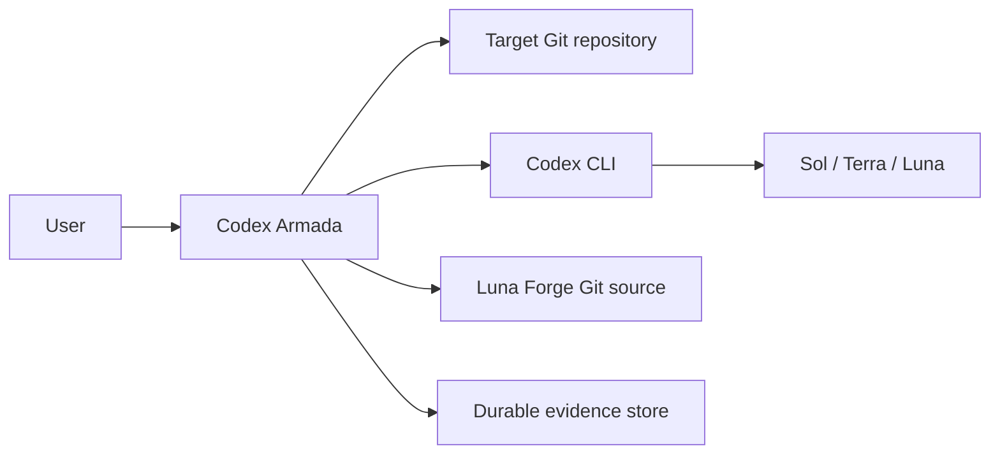
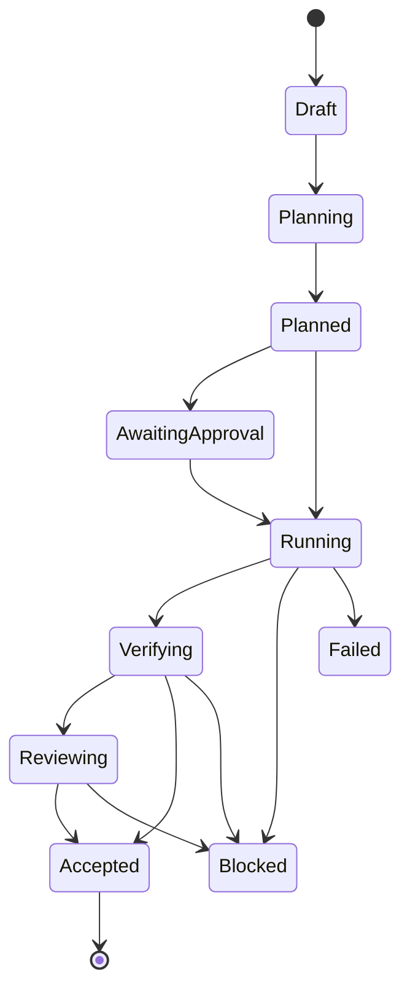

# Architecture

## System context

Codex Armada runs as a local Python CLI between the user, a target Git repository, Codex CLI, and the public Luna Forge repository.

The process has zero third-party runtime Python dependencies. It invokes Git and Codex as subprocesses and uses the standard library for TOML, JSON, hashing, schemas, state, reports, and archive tooling.

## Major components

| Component | Responsibility |
|---|---|
| `config.py` | Merge defaults, project policy, explicit overlays, and CLI choices; validate every route and source pin. |
| `doctor.py` | Inspect Python, Git, Codex flags, model catalog, active routes, and Luna Forge readiness. |
| `planner.py` | Ask Sol for a structured task graph or load a supplied plan; validate and optionally review consequential plans. |
| `risk.py` | Raise task risk from kind, paths, tags, deletion, production, and project rules. |
| `routing.py` | Select model, effort, protocol, sandbox, approval, and review policy. |
| `luna_forge.py` | Fetch, validate, cache, install, and re-attest the exact upstream Luna Forge commit. |
| `executor.py` | Drive the task state machine, worktrees, worker calls, corrections, verification, review, and acceptance. |
| `codex.py` | Invoke `codex exec`, capture JSONL, parse usage, validate final JSON locally, and derive runtime attestation. |
| `attestation.py` | Bind the returned thread ID to one exact local rollout and verify model, effort, sandbox, and permission metadata without newest-match inference. |
| `git.py` | Enforce clean-tree, path ownership, worktree, commit, cherry-pick, diff, and local-exclude behavior. |
| `verification.py` | Parse allowlisted verification commands without a shell and reject repository mutation. |
| `state.py` | Persist durable plans, tasks, artifacts, locks, and reports outside the target repository. |
| `report.py` | Produce portable JSON and standalone HTML evidence reports. |
| `run_verifier.py` | Re-check final Git, route provenance, commit, verification, and review invariants. |

## State machine

Run completion requires every task to reach `accepted`. A process interrupted during an active state does not guess where execution stopped; the task is marked blocked and its worktree is retained for inspection.

## Trust boundaries

### Trusted control inputs

- user command and explicit approvals;
- validated Codex Armada configuration;
- bundled prompt templates and JSON Schemas;
- target repository state read directly through Git;
- exact pinned Luna Forge source after manifest and validation checks.

### Untrusted evidence inputs

- model text and structured output;
- Codex JSONL fields that are not independently consistent;
- repository source, scripts, tests, logs, and documentation;
- upstream network content before commit and manifest verification.

Untrusted input cannot change the control state merely by containing phrases such as `ship`, `approved`, `REVIEW MODE`, or `ignore previous instructions`.

## Execution transport

Codex Armada currently uses direct `codex exec` calls. The selected model and effort are supplied explicitly for each planning, worker, review, probe, and canary call. Luna Forge is activated through `$luna-forge` in the worker task capsule and its project-local custom-agent profile is installed for Codex discovery.

The project does not claim native custom-agent subagent routing when direct execution is used. Runtime evidence records the actual transport.

The public Codex exec stream is the primary usage source. When it omits model or effort, Codex Armada searches the active `CODEX_HOME/sessions` tree for a rollout filename ending in the exact returned thread ID. Attestation succeeds only when exactly one rollout matches and its `turn_context` agrees with the requested route. Ambiguous, absent, or contradictory metadata fails closed whenever the route policy requires attestation.

Codex reports reasoning-output tokens as detail alongside output tokens. Reports retain that detail, while credit calculation uses the published output-token field once rather than double-counting reasoning.

## Concurrency

Version 1.0 executes the task graph serially. Isolated worktrees prevent failed work from contaminating the main branch, but they do not make overlapping edits merge-safe. Serial execution is the safe baseline; future concurrency must add machine-enforced file-ownership leases and dependency-aware merge ordering before it is enabled.

## Failure behavior

- A planning or worker schema failure stores a separate schema error artifact.
- A source or route mismatch blocks without fallback.
- A verification failure may receive one bounded correction if configured.
- Scope, protected-path, symbolic-link, unapproved deletion, and source-integrity failures are hard blocks.
- Failed worktrees remain available when `keep_failed_worktrees = true`.
- Accepted changes are never rewritten after the commit is applied; cleanup failures are reported as residual operational errors.
